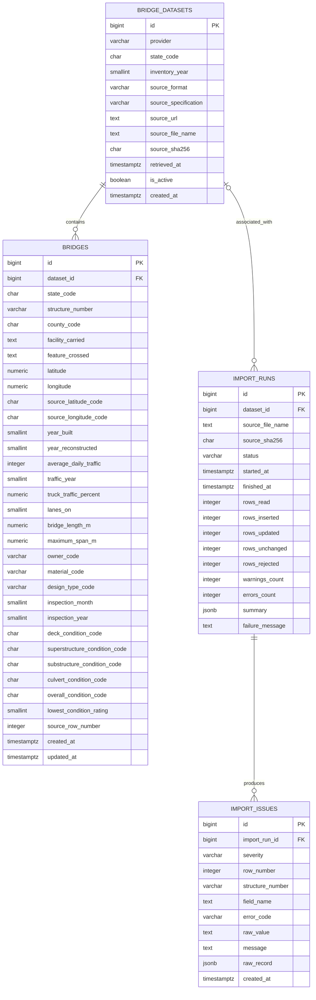

# Entity-Relationship Diagram (ERD)

This document describes the relational database schema for the active California bridge dataset, import tracking, source provenance, and diagnostics.

```mermaid
erDiagram
    BRIDGE_DATASETS ||--o{ BRIDGES : "contains"
    BRIDGE_DATASETS |o--o{ IMPORT_RUNS : "associated_with"
    IMPORT_RUNS ||--o{ IMPORT_ISSUES : "produces"

    BRIDGE_DATASETS {
        bigint id PK
        varchar provider
        char state_code
        smallint inventory_year
        varchar source_format
        varchar source_specification
        text source_url
        text source_file_name
        char source_sha256
        timestamptz retrieved_at
        boolean is_active
        timestamptz created_at
    }

    BRIDGES {
        bigint id PK
        bigint dataset_id FK
        char state_code
        varchar structure_number
        char county_code
        text facility_carried
        text feature_crossed
        numeric latitude
        numeric longitude
        char source_latitude_code
        char source_longitude_code
        smallint year_built
        smallint year_reconstructed
        integer average_daily_traffic
        smallint traffic_year
        numeric truck_traffic_percent
        smallint lanes_on
        numeric bridge_length_m
        numeric maximum_span_m
        varchar owner_code
        varchar material_code
        varchar design_type_code
        smallint inspection_month
        smallint inspection_year
        char deck_condition_code
        char superstructure_condition_code
        char substructure_condition_code
        char culvert_condition_code
        char overall_condition_code
        smallint lowest_condition_rating
        integer source_row_number
        timestamptz created_at
        timestamptz updated_at
    }

    IMPORT_RUNS {
        bigint id PK
        bigint dataset_id FK
        text source_file_name
        char source_sha256
        varchar status
        timestamptz started_at
        timestamptz finished_at
        integer rows_read
        integer rows_inserted
        integer rows_updated
        integer rows_unchanged
        integer rows_rejected
        integer warnings_count
        integer errors_count
        jsonb summary
        text failure_message
    }

    IMPORT_ISSUES {
        bigint id PK
        bigint import_run_id FK
        varchar severity
        integer row_number
        varchar structure_number
        text field_name
        varchar error_code
        text raw_value
        text message
        jsonb raw_record
        timestamptz created_at
    }
```
